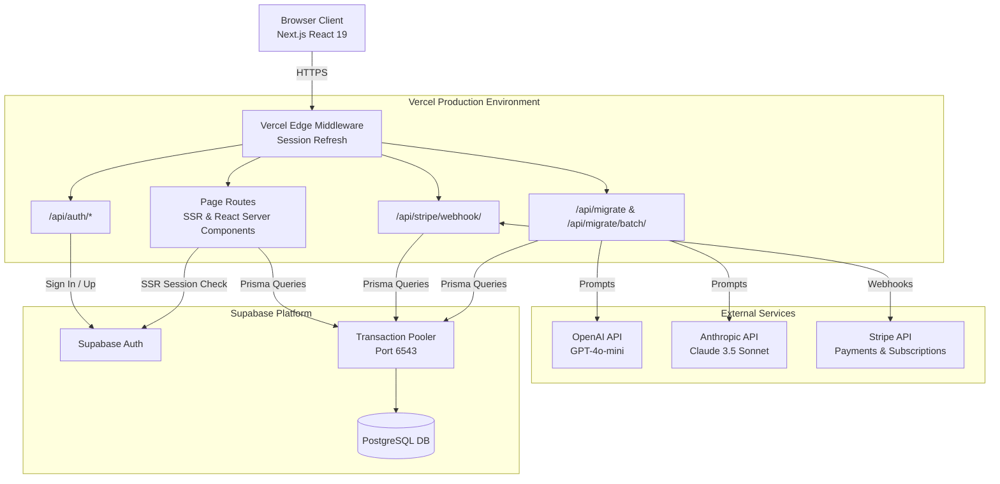
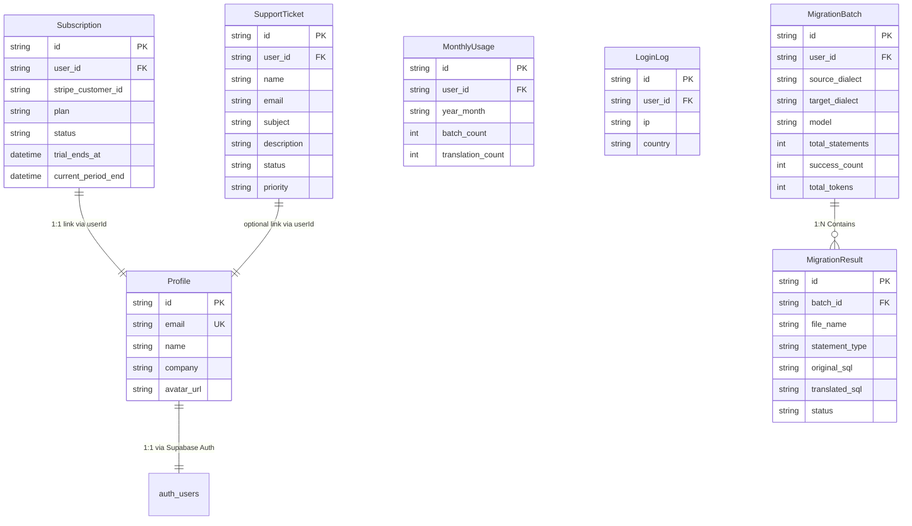

# MorphDB — Architecture & Product Documentation

> **Last Updated**: 2026-02-24
> **Version**: 1.1.0 (Developer Beta)
> **Maintainer**: codeman403
> **Context**: Built as part of the AI Vibe Coding Hackathon
> **Live URL**: [https://morphdb.vercel.app/](https://morphdb.vercel.app/)

---

## Product Overview

MorphDB is an advanced, AI-powered database migration co-pilot engineered to accelerate and de-risk the transition from legacy relational database management systems (RDBMS) to modern cloud-native data warehouses.

### The Problem: The Migration Bottleneck
Historically, migrating enterprise data stacks (e.g., from SQL Server or Oracle to Snowflake or BigQuery) has been a highly manual, error-prone, and capital-intensive process. Data engineering teams spend thousands of hours rewriting proprietary SQL dialects, untangling complex stored procedures, and resolving dialect-specific syntax mismatches. This manual translation creates a severe bottleneck, delaying digital transformation initiatives and introducing significant operational risk due to potential business logic deviations.

### Core Capabilities
MorphDB leverages advanced Large Language Models (OpenAI GPT-4o-mini and Anthropic Claude 3.5 Sonnet) to serve as a semantic translation engine rather than a rigid, regex-based parser. Its current capabilities include:
- **Intelligent Dialect Translation**: Translates complex SQL Server (T-SQL), Oracle (PL/SQL), MySQL, and PostgreSQL queries into highly optimized Snowflake (dbt Jinja), PostgreSQL, BigQuery, and Redshift dialects.
- **Context-Aware Logic Preservation**: Understands and maps proprietary functions, varying data types, and implicit execution behaviors (such as date arithmetic or null handling) to their exact modern equivalents.
- **Batch Processing Engine**: Ingests massive, multi-statement SQL dumps, automatically tokenizing, classifying, and translating hundreds of tables, views, and procedures concurrently.
- **Developer-Centric Tooling**: Provides side-by-side AST-aware diffing, actionable warnings for manual review constraints, and downloadable artifacts ready for immediate CI/CD deployment.

### Target Audience
- **Data & Analytics Engineers**: Automates the tedious syntax conversion process, allowing engineers to focus on architectural optimization, data modeling, and pipeline reliability.
- **Database Administrators (DBAs)**: Empowers traditional DBAs to safely port schemas to unfamiliar cloud environments without requiring deep, pre-existing expertise in the target dialect.
- **Migration Consultants & System Integrators**: Drastically reduces the time-to-value for client cloud migration projects, increasing margins and accelerating project throughput.
- **CTOs & Data Leaders**: De-risks massive cloud migration initiatives, reduces the dual-running costs of maintaining legacy on-premise systems, and accelerates the return on investment for cloud infrastructure.

### Future Potential & Unlocked Features
By parsing and understanding the semantic intent of database schemas, MorphDB serves as a foundational layer for a fully automated data modernization suite. As the product matures, it possesses the potential to unlock:
- **Automated dbt Project Scaffolding**: Direct generation of `schema.yml`, staging models, testing configurations, and lineage graphs natively derived from legacy DDL.
- **Automated Data Validation & Testing**: Generation of parity-checking scripts to mathematically prove that the source legacy system and the target cloud system produce identical outputs.
- **Intelligent Schema Optimization**: AI-driven architectural suggestions to automatically convert highly normalized operational schemas (3NF) into denormalized, analytical star schemas optimized for modern columnar data warehouses.
- **Continuous Integration (CI/CD) Hooks**: Automated, pipeline-driven translations that hook into GitHub Actions, automatically converting legacy queries pushed to a repository into modern pull requests on the target data stack.

---

## Table of Contents

1. [Architecture Overview](#architecture-overview)
2. [Tech Stack](#tech-stack)
3. [Features Implemented](#features-implemented)
4. [Upcoming Features](#upcoming-features)
5. [Database Schema](#database-schema)
6. [Security & Authentication](#security--authentication)
7. [Deployment](#deployment)

---

## Architecture Overview
## Architecture Overview

MorphDB utilizes a modern, serverless architecture centered around Next.js App Router, deployed on Vercel. 



- **Frontend**: React 19, Tailwind CSS v4, Framer Motion for animations.
- **Backend**: Next.js API Routes handle AI translation, rate limiting, and Stripe webhooks.
- **Database**: Supabase PostgreSQL accessed via Prisma ORM. Uses connection pooling (port 6543) for application queries and direct connection for migrations.
- **Authentication**: Supabase Auth with server-side rendering (SSR) and middleware session management.
- **AI Translation**: Intelligent routing between OpenAI (GPT-4o-mini for Free tier) and Anthropic (Claude 3.5 Sonnet for Pro tier).

## Tech Stack

- **Framework**: Next.js 16.1.6 (App Router)
- **UI**: React 19.2.3, Tailwind CSS 4.x
- **Animations**: Framer Motion 12.x
- **Icons**: Lucide React
- **ORM**: Prisma 7.4.1 (with pg adapter)
- **Database**: Supabase PostgreSQL
- **Auth**: Supabase SSR
- **Payments**: Stripe 20.x
- **AI**: OpenAI SDK, Anthropic SDK
- **Toast Notifications**: Sonner
- **Hosting**: Vercel

---

## Features Implemented

### 1. Tier-Based Pricing & Access Control
A robust 4-tier pricing system (Free, Pro, Design Partner, Enterprise).
- **Free Tier**: 5 batches/month, 10 files/batch, 50 translations/month. Limited to GPT-4o-mini.
- **Pro Tier**: 50 batches/month, 50 files/batch, 500 translations/month. Unlocks Claude models.
- **3-Day Free Trial**: New users can start a 3-day free Pro trial with full Pro features. Trial ends automatically after 3 days, reverting to Free tier.
- **Enforcement**: Middleware and API routes strictly enforce quotas and model access based on the user's active Stripe subscription or trial status.

### 2. Batch Migration Engine
- **File Upload**: Drag & drop support for `.sql` and `.txt` files (max 500KB per file).
- **Multi-Statement Parsing**: Custom SQL parser splits large files into individual logical statements (tables, views, procedures).
- **AI Translation**: Translates source dialects to target dialects while preserving business logic and generating dbt syntax where applicable.
- **Progress Tracking**: Real-time visual progress bar during batch processing.
- **Source/Target Display**: Translation results show source and target database names (e.g., "SQL Server → Snowflake (dbt)").

### 3. Support System
- **Support Page** (`/support`): Dedicated support page for users to submit inquiries.
- **Ticket Management**: Support tickets are stored in the database with name, email, subject, and description fields.
- **Status Tracking**: Tickets have status (open, in_progress, resolved) and priority (low, medium, high).
- **Admin View**: Admin panel includes a "Support Tickets" tab to view and manage all support requests.

### 4. Admin Dashboard
- **User Management**: View waitlist entries, login logs, and user signups.
- **Usage Reset**: Admin can reset any user's monthly usage limits.
- **Support Ticket Management**: View and manage support tickets.
- **Real-time Stats**: View system-wide statistics including active users, subscriptions, and support tickets.
## Database Schema



The core schema includes:
- `Profile`: User metadata linked to Supabase Auth.
- `Subscription`: Tracks Stripe customer, active plan details, and trial expiration (`trial_ends_at`).
- `MigrationBatch`: High-level summary of a migration run (source, target, total tokens).
- `MigrationResult`: Individual SQL statement translations linked to a batch.
- `MonthlyUsage`: Tracks rolling monthly quotas for rate limiting.
- `LoginLog`: Security audit trail.
- `WaitlistEntry`: Pre-launch lead capture.
- `SupportTicket`: User support inquiries with status and priority tracking.

### 5. Authentication & User Management
- Secure email/password login and registration via Supabase.
- Session persistence via Next.js middleware.
- Admin dashboard (`/dashboard/admin`) for viewing system-wide stats (waitlist, active users, login logs, support tickets).

### 6. 3-Day Free Trial
- New users can start a 3-day free Pro trial from the Pricing page.
- Trial provides full Pro features immediately (no payment required).
- Dashboard displays trial status and remaining days.
- After 3 days, user automatically reverts to Free tier.

### 7. Stripe Monetization
- Integrated checkout flow for upgrading to Pro/Design Partner tiers.
- Robust webhook handler (`/api/stripe/webhook`) processing `checkout.session.completed`, `customer.subscription.updated`, and `customer.subscription.deleted` events to manage access tiers automatically.

---

## Upcoming Features

The following features are slated for future iterations:

1. **dbt Project Generation (P3)**: Automatically scaffold a complete dbt project directory structure, including `models/`, `sources.yml`, and `schema.yml` test definitions directly from the translated SQL.
2. **Advanced Diff Viewer (P3)**: Implement a granular, line-by-line highlighted diff viewer (similar to GitHub pull requests) for easier review of SQL changes.
3. **Multi-file Schema Context**: Allow the AI to understand relationships between multiple uploaded files simultaneously (e.g., resolving foreign keys across separate table definition files).
4. **Team Workspaces**: Shared migration history and centralized billing for organizational teams.
5. **Migration Validation Engine**: Built-in syntax checking against target data warehouse dialects before export.

---

## Deployment

Deployed exclusively via Vercel connecting to a Supabase backend.

**Key Environment Variables required for production:**
- `NEXT_PUBLIC_SUPABASE_URL`
- `NEXT_PUBLIC_SUPABASE_ANON_KEY`
- `DATABASE_URL` (Supabase Pooler)
- `OPENAI_API_KEY`
- `ANTHROPIC_API_KEY`
- `STRIPE_SECRET_KEY`
- `STRIPE_WEBHOOK_SECRET`
- `STRIPE_PRO_PRICE_ID`
- `NEXT_PUBLIC_SITE_URL`

*(Schema migrations are handled manually via Supabase SQL Editor to bypass pooler limitations during Vercel builds.)*

---

## API Routes

### Core Routes
- `POST /api/migrate` - Single SQL translation
- `POST /api/migrate/batch` - Batch SQL translation with file upload support
- `POST /api/auth/signup` - User registration
- `POST /api/auth/signin` - User login
- `POST /api/auth/signout` - User logout

### Subscription & Payments
- `POST /api/stripe/checkout` - Create Stripe checkout session
- `POST /api/stripe/webhook` - Handle Stripe webhook events
- `POST /api/trial` - Start 3-day free Pro trial

### Support
- `POST /api/support` - Submit support ticket

### Admin Routes
- `GET /api/admin/stats` - Fetch system-wide statistics
- `GET /api/admin/support` - Fetch all support tickets
- `PATCH /api/admin/support` - Update support ticket status
- `POST /api/admin/reset-usage` - Reset user(s) monthly usage

---

## Database Setup SQL

Execute the following SQL in Supabase SQL Editor to create the required tables:

```sql
-- Support Tickets Table
CREATE TABLE IF NOT EXISTS support_tickets (
  id UUID PRIMARY KEY DEFAULT gen_random_uuid(),
  user_id UUID,
  name TEXT NOT NULL,
  email TEXT NOT NULL,
  subject TEXT NOT NULL,
  description TEXT NOT NULL,
  status TEXT NOT NULL DEFAULT 'open',
  priority TEXT NOT NULL DEFAULT 'medium',
  created_at TIMESTAMP WITH TIME ZONE DEFAULT NOW(),
  updated_at TIMESTAMP WITH TIME ZONE DEFAULT NOW()
);

CREATE INDEX IF NOT EXISTS idx_support_tickets_user_id ON support_tickets(user_id);
CREATE INDEX IF NOT EXISTS idx_support_tickets_status ON support_tickets(status);
CREATE INDEX IF NOT EXISTS idx_support_tickets_created_at ON support_tickets(created_at DESC);

-- Add trial_ends_at column to subscriptions
ALTER TABLE subscriptions ADD COLUMN IF NOT EXISTS trial_ends_at TIMESTAMP WITH TIME ZONE;
```